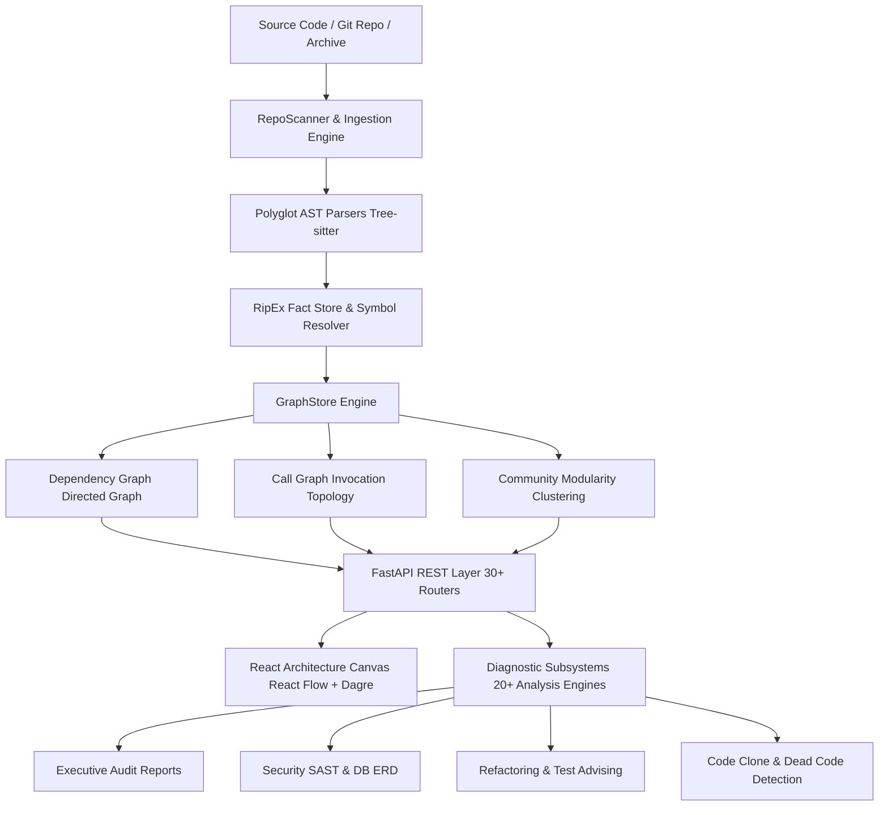

# NOUS Comprehensive Documentation & User Manual
### Software Architecture Intelligence & Static Code Analysis Platform

---

## Table of Contents

1. [Platform Overview & Philosophy](#1-platform-overview--philosophy)
2. [System Architecture & Data Pipeline](#2-system-architecture--data-pipeline)
3. [Installation & Deployment](#3-installation--deployment)
   - [Prerequisites](#prerequisites)
   - [Development Setup (Local Dev)](#development-setup-local-dev)
   - [Production Single-Binary Deployment](#production-single-binary-deployment)
   - [Containerized Deployment (Docker & Docker Compose)](#containerized-deployment-docker--docker-compose)
4. [Workspace & Ingestion Management](#4-workspace--ingestion-management)
   - [Deterministic Zero-State Architecture](#deterministic-zero-state-architecture)
   - [Local Directory Ingestion](#local-directory-ingestion)
   - [Remote Git Repositories (GitHub, GitLab, Bitbucket)](#remote-git-repositories-github-gitlab-bitbucket)
   - [Single Source Files & ZIP Archives](#single-source-files--zip-archives)
   - [Real-Time Hot-Reloading Watch Mode](#real-time-hot-reloading-watch-mode)
5. [Interactive Architecture Visualization Canvas](#5-interactive-architecture-visualization-canvas)
   - [Multi-Tier Visual Lenses](#multi-tier-visual-lenses)
   - [Minimap Viewport Radar & Sector Navigation](#minimap-viewport-radar--sector-navigation)
   - [Node Inspector & In-Depth Symbol Diagnostics](#node-inspector--in-depth-symbol-diagnostics)
   - [Canvas Filter Bar & Grouping](#canvas-filter-bar--grouping)
6. [Core Feature Guide & Diagnostic Subsystems](#6-core-feature-guide--diagnostic-subsystems)
   - [1. Executive Architecture & Security Audit Report](#1-executive-architecture--security-audit-report)
   - [2. Universal Omni-Command Palette (Ctrl+K / Cmd+K)](#2-universal-omni-command-palette-ctrlk--cmdk)
   - [3. Diagram & Code Export Suite](#3-diagram--code-export-suite)
   - [4. Architecture Boundary Linter & Rule Engine](#4-architecture-boundary-linter--rule-engine)
   - [5. Static Application Security Testing (SAST)](#5-static-application-security-testing-sast)
   - [6. Database Schema & Relational ERD Analyzer](#6-database-schema--relational-erd-analyzer)
   - [7. Blast Radius & Pull Request Impact Analyzer](#7-blast-radius--pull-request-impact-analyzer)
   - [8. Structural Code Clone Detector](#8-structural-code-clone-detector)
   - [9. Dead Code & Orphaned Symbol Detector](#9-dead-code--orphaned-symbol-detector)
   - [10. Intelligent Test Advisor & Stub Synthesizer](#10-intelligent-test-advisor--stub-synthesizer)
   - [11. Intelligent Refactoring Advisor](#11-intelligent-refactoring-advisor)
   - [12. Technical Debt Engine (8-Dimension Scorecard)](#12-technical-debt-engine-8-dimension-scorecard)
   - [13. API Request Flow & Lifecycle Tracer](#13-api-request-flow--lifecycle-tracer)
   - [14. Architecture Drift & Evolution Detector](#14-architecture-drift--evolution-detector)
   - [15. Repository Time Machine](#15-repository-time-machine)
   - [16. Execution Playback Simulator](#16-execution-playback-simulator)
   - [17. Module Health Matrix](#17-module-health-matrix)
   - [18. Automatic Documentation Generator](#18-automatic-documentation-generator)
   - [19. Modernization & Migration Planner](#19-modernization--migration-planner)
   - [20. Architecture Style & Pattern Detector](#20-architecture-style--pattern-detector)
7. [REST API Reference](#7-rest-api-reference)
8. [Keyboard Shortcuts & Hotkeys](#8-keyboard-shortcuts--hotkeys)
9. [Performance Optimization for Large Monorepos](#9-performance-optimization-for-large-monorepos)

---

## 1. Platform Overview & Philosophy

**Nous** is an automated software architecture intelligence and static codebase analysis platform. It ingests polyglot source code repositories, constructs unified Abstract Syntax Tree (AST) representations, maps dependency and call graphs, and renders interactive, real-time architectural topology with integrated static analysis and diagnostics.

### Core Design Principles
- **100% Deterministic Analysis**: All structural metrics, graph traversals, and diagnostic findings are calculated directly from AST syntax trees and graph theory algorithms. There are no stochastic hallucinations or arbitrary guesses.
- **Zero Cloud Dependencies**: Nous operates entirely on local hardware. No API keys, cloud tokens, or external network connections are required for full static analysis.
- **Polyglot Parsing Support**: Supports Python, TypeScript, JavaScript, Go, Rust, Java, Kotlin, SQL DDL, Prisma schema definitions, Vue, Svelte, and C/C++.
- **Single-Page Application Architecture**: Backed by a high-performance FastAPI server and a reactive React/Vite frontend with hardware-accelerated WebGL/SVG canvas rendering.

---

## 2. System Architecture & Data Pipeline

The following diagram illustrates the end-to-end data flow in Nous, from raw source files to interactive visualization and diagnostics:



### Pipeline Components

1. **Ingestion & Scanner (`backend/app/scanner.py`)**: Traverses the target directory, respects `.gitignore` rules, identifies language file extensions, and dispatches parsing jobs to parser workers.
2. **Parser Engine (`backend/app/parsers/`)**: Extracts concrete syntax trees, functions, classes, interfaces, import statements, call expressions, database schemas, and API route decorators using Tree-sitter and AST engines.
3. **Fact Store (`backend/app/analysis/ripex_store.py`)**: Maintains a relational index of symbols, caller-callee bindings, inheritance hierarchies, and endpoint definitions.
4. **Graph Modeling Store (`backend/app/graph/graph_store.py`)**: Computes directed acyclic dependencies, circular dependency cycles (Tarjan's strongly connected components), in-degree/out-degree centralities, and Louvain modularity clusters.
5. **FastAPI Analysis Subsystems (`backend/app/analysis/`)**: 20+ specialized engines evaluate architectural health, security flaws, technical debt, code clones, and refactoring opportunities.
6. **Interactive Canvas (`frontend/src/components/canvas/`)**: Renders hierarchical directed graphs with animated edge dataflows, zoom controls, and minimap radar navigation.

---

## 3. Installation & Deployment

### Prerequisites
- **Python**: Version `3.11` or higher
- **Node.js**: Version `18.0` or higher (with `npm`)
- **Git**: Installed and available in your system `$PATH`

---

### Development Setup (Local Dev)

#### 1. Clone the Repository
```bash
git clone https://github.com/Dhyanesh2603/Nous.git
cd Nous
```

#### 2. Configure & Start Backend
```bash
cd backend
python -m venv .venv

# On Linux/macOS:
source .venv/bin/activate
# On Windows (PowerShell):
.venv\Scripts\Activate.ps1

pip install -e .
python -m uvicorn app.main:app --host 127.0.0.1 --port 8000 --reload
```
The backend API documentation is accessible at `http://127.0.0.1:8000/docs`.

#### 3. Configure & Start Frontend
In a separate terminal:
```bash
cd frontend
npm install
npm run dev -- --host 127.0.0.1 --port 5173
```
Open `http://localhost:5173/` in your browser.

---

### Production Single-Binary Deployment

FastAPI can serve the production-built React frontend directly as static files:

```bash
# 1. Build Frontend Static Assets
cd frontend
npm run build

# 2. Start FastAPI Production Server
cd ../backend
python -m uvicorn app.main:app --host 0.0.0.0 --port 8000
```
Open `http://127.0.0.1:8000/` to access the full application from a single port.

---

### Containerized Deployment (Docker & Docker Compose)

Nous includes a production-ready multi-stage Docker build:

```bash
# Build and launch container in detached mode
docker compose up -d --build
```
Access the application at `http://localhost:8000`.

To stop the container:
```bash
docker compose down
```

---

## 4. Workspace & Ingestion Management

### Deterministic Zero-State Architecture
When Nous is launched, it starts in a clean, unpopulated state (`has_active_repo: false`). Users must explicitly select, clone, or upload a codebase before analysis is executed. This prevents cross-contamination and ensures isolated analysis sessions.

```
+-------------------------------------------------------------+
|                      NO REPOSITORY LOADED                   |
|                                                             |
|  [ Ingest Local Folder ]   [ Clone Remote Git ]   [ Samples ]|
+-------------------------------------------------------------+
```

### Ingestion Methods

#### 1. Local Directory Ingestion
- Click **Ingest Repository** from the top header or welcome screen.
- Select the **Local Folder** tab.
- Enter the absolute filesystem path (e.g., `/home/user/projects/my-app` or `D:\projects\my-app`).
- Click **Analyze Repository**.

#### 2. Remote Git Repositories
- Select the **Git URL** tab.
- Enter any public or accessible Git repository URL (e.g., `https://github.com/fastapi/fastapi.git`).
- *(Optional)* Specify a target branch (e.g., `main`, `v2.0`).
- Click **Clone & Analyze**. Nous performs a shallow clone (`--depth 50`) with full commit history indexing into a sandboxed cache directory.

#### 3. Single Source Files & ZIP Archives
- Select the **Upload Archive / File** tab.
- Drag and drop a single source code file (`.py`, `.ts`, `.go`, `.rs`, `.java`, `.sql`) or a compressed `.zip` archive.
- Nous automatically extracts and analyzes the contents in an isolated environment.

#### 4. Quick Sample Workspaces
- Built-in sample repositories (e.g., Python Backend Microservice, TypeScript Web App) are available on the welcome screen for instant evaluation.

### Real-Time Hot-Reloading Watch Mode
- When analyzing an active local codebase, click the **Watch Mode** toggle in the header.
- Nous runs a background filesystem observer (`watchdog`). Any file modifications, additions, or deletions trigger an incremental re-scan and hot-update the visual canvas without requiring a page reload.

---

## 5. Interactive Architecture Visualization Canvas

The Architecture Canvas renders graph models generated from your codebase.

```
+-------------------------------------------------------------------------------+
| [ Lenses: File | Cluster | Call Graph | Frontend | Backend ]   [ Filter / Search ]|
+-------------------------------------------------------------------------------+
|                                                                               |
|      [AuthController] ------> [AuthService] ------> [UserRepository]          |
|             |                       |                                         |
|             v                       v                                         |
|      [JWT Middleware]         [TokenCache]                                    |
|                                                                               |
+-------------------------------------------------------------------------------+
| [ Minimap Radar Lens: Zoom 20%-200% | Sectors: Top / Mid / Base ]              |
+-------------------------------------------------------------------------------+
```

### Multi-Tier Visual Lenses
Switch views via the top lens bar:

| Lens | Description | Best For |
|---|---|---|
| **File Dependencies** | File-to-file imports and module coupling directed graph | Understanding file organization and import hierarchies |
| **Module Clusters** | High-level subsystem clusters grouped by community modularity | High-level system architecture and domain boundaries |
| **Call Graph** | Cross-file function and method invocation paths | Tracing execution flows and caller-callee bindings |
| **Frontend Lens** | UI components, React hooks, routers, and client state files | Inspecting frontend component trees and routing |
| **Backend Lens** | Controllers, API routes, domain services, middleware, and models | Auditing server-side architecture and data flow |

### Minimap Viewport Radar & Sector Navigation
Located in the bottom-right corner of the canvas:
- **Continuous Zoom Slider**: Adjust magnification from `20%` to `200%` with smooth canvas recentering.
- **Interactive Viewport Frame**: A draggable bounding box inside the radar minimap allows rapid panning across sprawling graphs.
- **Discrete Sector Jump Buttons**:
  - `Top / Ingress`: Focuses on top-level entrypoints (Controllers, Routers, UI Pages).
  - `Mid / Core`: Centers on domain business logic and service layers.
  - `Base / Persistence`: Jumps to database repositories, ORMs, and utility layers.

### Node Inspector
Clicking any node in the canvas opens the **Node Inspector** drawer:
- **Symbol Metadata**: File path, line count, language type, and cyclomatic complexity `v(G)`.
- **Dependency Statistics**: Exact In-Degree (dependents) and Out-Degree (dependencies).
- **Import / Export Catalog**: Complete listing of imported libraries and exported functions/classes.
- **Source Code Viewer**: Syntax-highlighted code preview with direct line jumping.
- **Blast Radius Launcher**: Triggers a downstream reachability calculation from the inspected node.

---

## 6. Core Feature Guide & Diagnostic Subsystems

Nous provides a comprehensive suite of 20 deterministic static analysis and diagnostic tools.

---

### 1. Executive Architecture & Security Audit Report
**Access**: Click `Audit Report` in the header or repository dashboard.

Generates a unified executive audit report synthesizing the complete architectural state of the repository:
- **Composite Scorecard**: Overall Health Grade (A–F), Maintainability Index, SAST Security Score, Complexity Factor, and Drift Index.
- **Prioritized Remediation Matrix**: Concrete action items categorized by severity (**P0 Critical**, **P1 High**, **P2 Medium**, **P3 Low**).
- **1-Click Export & Print**: Download full markdown reports (`.md`) or trigger browser-native print-to-PDF formatting.

---

### 2. Universal Omni-Command Palette (`Ctrl+K` / `Cmd+K`)
**Access**: Press `Ctrl+K` (Windows/Linux) or `Cmd+K` (macOS), or click the Search bar.

A dual-mode universal launcher:
- **AST Symbol Search**: Search for functions, classes, interfaces, methods, and files with instant keyword matching (BM25 + Reciprocal Rank Fusion). Selecting a symbol highlights and centers it in the canvas.
- **Action Launcher (`>`)**: Type `>` to search and trigger any modal, tool, view lens, or ingestion dialog directly from your keyboard.

---

### 3. Diagram & Code Export Suite
**Access**: Click `Tools ▾ -> Export Diagrams & Topology` or use the canvas export button.

Export the current architecture graph in industry-standard formats:
- **High-Resolution PNG**: Export at `1x`, `2x`, or `3x` pixel densities with high-contrast background rendering.
- **Vector SVG**: Clean, infinitely scalable vector graphic for documentation.
- **Mermaid.js Flowchart**: Ready-to-embed Markdown diagram format.
- **PlantUML Class Diagram**: Component and class dependency specification.
- **Topology JSON**: Complete node and edge graph data for custom tooling and automation pipelines.

---

### 4. Architecture Boundary Linter & Rule Engine
**Access**: Click `Tools ▾ -> Boundary Rules & Linter`.

Enforces structural layering constraints and detects unauthorized cross-layer dependencies:
- **Layer Constraint Rules**: Define forbidden dependencies (e.g., `Persistence Layer` cannot import `UI Layer`).
- **Violation Catalog**: Highlights specific file paths, import lines, and rules violated with severity tags.

---

### 5. Static Application Security Testing (SAST)
**Access**: Click `Tools ▾ -> Security & Vulnerability Audit`.

Performs AST-level pattern matching for security anti-patterns:
- **Hardcoded Secrets**: Detects API keys, JWT tokens, AWS credentials, and private keys.
- **Injection Vectors**: Identifies unparameterized raw SQL queries and unsafe `eval()` / `exec()` calls.
- **Insecure Configurations**: Highlights disabled SSL verification, permissive CORS policies, and missing CSRF protections.

---

### 6. Database Schema & Relational ERD Analyzer
**Access**: Click `Tools ▾ -> Database & Schema ERD`.

Parses relational database definitions from SQL DDL files (`CREATE TABLE`, `ALTER TABLE`) and Prisma schema files:
- **Entity-Relationship Diagram**: Visualizes tables, primary keys, foreign key relationships, and cardinalities.
- **Schema Metric Table**: Reports column data types, indices, nullable constraints, and unique constraints.

---

### 7. Blast Radius & Pull Request Impact Analyzer
**Access**: Click `Tools ▾ -> PR Blast Radius Analyzer` or right-click any canvas node.

Calculates downstream transitive reachability:
- **Blast Radius Percentage**: Quantifies the percentage of the codebase impacted if a specific module is modified, broken, or deprecated.
- **Cascade Tree**: Displays the exact dependency propagation paths.
- **PR Diff Target**: Analyzes local Git diffs (`HEAD~1` vs `HEAD`) to evaluate the blast radius of proposed pull requests.

---

### 8. Structural Code Clone Detector
**Access**: Click `Tools ▾ -> Code Clone & Duplication Detector`.

Uses AST syntax subtree hashing to find duplicated logic:
- **Type-1 Exact Clones**: Identical syntax trees (excluding whitespace and comments).
- **Type-2 Parameterized Clones**: Structurally identical syntax subtrees with renamed identifiers or variables.
- **Refactoring Recommendations**: Highlights candidates for extraction into shared utility functions.

---

### 9. Dead Code & Orphaned Symbol Detector
**Access**: Click `Tools ▾ -> Dead Code & Unused Symbols`.

Scans the call graph and import registry for unreachable symbols:
- **Unused Functions & Methods**: Zero in-degree call reachability across all files.
- **Unreferenced Classes & Interfaces**: Declared but never imported or instantiated.
- **Orphaned Modules**: Entire source files with zero inbound dependencies.

---

### 10. Intelligent Test Advisor & Stub Synthesizer
**Access**: Click `Tools ▾ -> Test Coverage Advisor`.

Identifies high-complexity, high-risk functions lacking unit test coverage:
- **Risk Assessment**: Evaluates Cyclomatic Complexity `v(G)` combined with In-Degree caller counts.
- **Automated Test Stub Synthesis**: Generates ready-to-run unit test boilerplate tailored to your testing framework (`pytest`, `jest`, `vitest`, `go test`).
- **1-Click Copy**: Copy synthesized test code directly to your clipboard.

---

### 11. Intelligent Refactoring Advisor
**Access**: Click `Tools ▾ -> Refactoring Advisor`.

Detects code smell patterns and provides concrete transformation guides:
- **Extraction Candidates**: Functions with high cyclomatic complexity and large line counts.
- **Split File Recommendations**: Modules containing multiple unrelated responsibilities.
- **Cycle Breakers**: Concrete strategies for breaking circular dependency knots.

---

### 12. Technical Debt Engine (8-Dimension Scorecard)
**Access**: Click `Tools ▾ -> Technical Debt Engine`.

Evaluates architectural debt across 8 weighted structural dimensions:
1. **Complexity Debt**: Concentration of high-complexity algorithms.
2. **Coupling & Cohesion**: High fan-in/fan-out ratios.
3. **Circular Cycles**: Strongly connected components in the dependency graph.
4. **Code Duplication**: Clone density across modules.
5. **File Size Sizing**: Oversized "God" files.
6. **Documentation Coverage**: Ratio of undocumented public symbols.
7. **Dead Code Ratio**: Percentage of unreachable code.
8. **Git Churn Volatility**: High modification frequencies in complex files.

---

### 13. API Request Flow & Lifecycle Tracer
**Access**: Click `Tools ▾ -> API Flow & Lifecycle`.

Traces the complete lifecycle of HTTP API endpoints:
- **Route Catalog**: Extracts HTTP methods (`GET`, `POST`, `PUT`, `DELETE`), URL paths, and handler symbols.
- **End-to-End Execution Trace**: Visualizes the call pipeline: `HTTP Route -> Controller -> Middleware -> Domain Service -> Data Layer -> Database`.

---

### 14. Architecture Drift & Evolution Detector
**Access**: Click `Tools ▾ -> Architecture Drift & Entropy`.

Compares the current codebase structure against historical baseline snapshots to detect architectural erosion:
- **Structural Entropy**: Measures increasing disorder and coupling over time.
- **Drift Violations**: Detects new dependencies that bypass standard module boundaries.

---

### 15. Repository Time Machine
**Access**: Click `Tools ▾ -> Repository Time Machine`.

Provides an interactive commit scrubber:
- **Historical Playback**: Replays git commits sequentially, animating the growth and restructuring of the dependency graph over time.
- **Churn Heatmap**: Identifies files and modules undergoing rapid modification.

---

### 16. Execution Playback Simulator
**Access**: Click `Tools ▾ -> Execution Playback`.

Simulates runtime execution pathways step-by-step:
- **Call Step Tracing**: Step forwards and backwards through functional call chains.
- **Interactive Highlighting**: Illuminates active nodes and edges on the visual canvas as execution proceeds.

---

### 17. Module Health Matrix
**Access**: Click `Tools ▾ -> Module Health Matrix`.

Displays a comparative tabular matrix of all repository modules:
- Compares Lines of Code (LOC), cyclomatic complexity, incoming callers, outgoing dependencies, and health grades across all packages.

---

### 18. Automatic Documentation Generator
**Access**: Click `Tools ▾ -> Documentation Generator`.

Synthesizes structured Markdown documentation directly from AST metadata:
- **Architecture Blueprints**: System summary, component roles, and subsystem interactions.
- **API Reference Guides**: Route parameters, request schemas, and response models.
- **Onboarding Guides**: High-level map for new contributors to understand the codebase.
- **1-Click Export**: Export sections as `.md` files.

---

### 19. Modernization & Migration Planner
**Access**: Click `Tools ▾ -> Migration Planner`.

Generates modernization roadmaps for legacy codebases:
- **Migration Plans**: E.g., JavaScript to TypeScript, Synchronous Python to Async/Await, CommonJS to ES Modules.
- **Phased Checklists**: Step-by-step conversion steps with target file lists and codemod command recommendations.

---

### 20. Architecture Style & Pattern Detector
**Access**: Click `Tools ▾ -> Architecture Style Detector`.

Classifies the dominant design patterns of the codebase:
- Detects Layered Architecture, Microservices, Hexagonal / Clean Architecture, MVC, and Event-Driven topologies with confidence scores.

---

## 7. REST API Reference

Nous exposes a comprehensive REST API over FastAPI. When the backend is running, complete interactive OpenAPI documentation is available at `http://127.0.0.1:8000/docs`.

### Core Endpoint Summary

| Category | Endpoint | Method | Description |
|---|---|---|---|
| **Health** | `/api/health` | `GET` | Service status, engine version, and active repository status |
| **Ingestion** | `/api/ingest` | `POST` | Ingest local path, Git URL, or branch |
| | `/api/ingest/upload` | `POST` | Upload single source file or ZIP archive |
| | `/api/ingest/status` | `GET` | Current scan progress and file count |
| | `/api/ingest/samples` | `GET` | List available built-in sample repositories |
| | `/api/ingest/watch/toggle` | `POST` | Toggle live filesystem hot-reloading |
| **Graph** | `/api/graph/structure` | `GET` | Complete node and edge graph topology (`view_mode=file\|module\|call`) |
| | `/api/graph/blast-radius` | `GET` | Transitive downstream reachability for a symbol or file |
| | `/api/graph/metrics` | `GET` | Graph-theoretic metrics (centrality, diameter, density) |
| **Search** | `/api/search` | `GET` | AST symbol and file search (BM25 + RRF) |
| **Audit** | `/api/analysis/executive-report` | `GET` | Complete executive architecture & security report |
| | `/api/analysis/health-scorecard` | `GET` | Multi-dimensional repository health scorecard |
| | `/api/analysis/tech-debt` | `GET` | 8-dimension weighted technical debt evaluation |
| | `/api/analysis/security-audit` | `GET` | Static application security (SAST) findings |
| | `/api/analysis/database-schema` | `GET` | SQL DDL & Prisma ERD relational models |
| | `/api/analysis/dead-code` | `GET` | Zero in-degree unused functions and classes |
| | `/api/analysis/clones` | `GET` | Exact (Type-1) and parameterized (Type-2) code clones |
| | `/api/analysis/refactoring` | `GET` | Code smell refactoring recommendations |
| | `/api/analysis/test-advice` | `GET` | High-complexity untested functions and test stubs |
| | `/api/analysis/rules/evaluate` | `POST` | Evaluate custom architectural boundary rules |
| | `/api/analysis/pr-impact` | `GET` | PR blast radius simulation against Git diff target |
| | `/api/analysis/docs/generate` | `GET` | Synthesize markdown documentation catalogs |
| | `/api/analysis/migration/plans` | `GET` | Modernization roadmaps and codemod checklists |
| | `/api/analysis/time-machine/frames` | `GET` | Historical commit playback frames |

---

## 8. Keyboard Shortcuts & Hotkeys

| Shortcut | Action |
|---|---|
| `Ctrl + K` / `Cmd + K` | Open Universal Omni-Command Palette & AST Search |
| `>` (in Command Palette) | Switch to Action Launcher mode |
| `↑` / `↓` | Navigate search results and actions |
| `Enter` | Select symbol / execute command |
| `Esc` | Close any active modal, drawer, or search dialog |
| `Scroll Wheel` | Zoom in/out on Architecture Canvas |
| `Click + Drag Canvas` | Pan across the visual canvas |

---

## 9. Performance Optimization for Large Monorepos

For repositories exceeding `10,000` files or `1,000,000` lines of code:
- **Respect `.gitignore`**: Nous automatically ignores `node_modules/`, `.git/`, `dist/`, `build/`, `vendor/`, and virtual environment directories to prevent unnecessary AST overhead.
- **Module Cluster Lens**: When dealing with dense graphs, switch to the **Module Cluster Lens** to view aggregated subsystem nodes rather than thousands of individual file nodes.
- **Dagre Node Layout Decoupling**: Large graphs automatically utilize optimized Web Worker thread calculations for responsive UI rendering.

---

## License & Attribution

Nous is licensed under the **MIT License**.
Copyright © 2026 Nous Architecture Engine Contributors.
