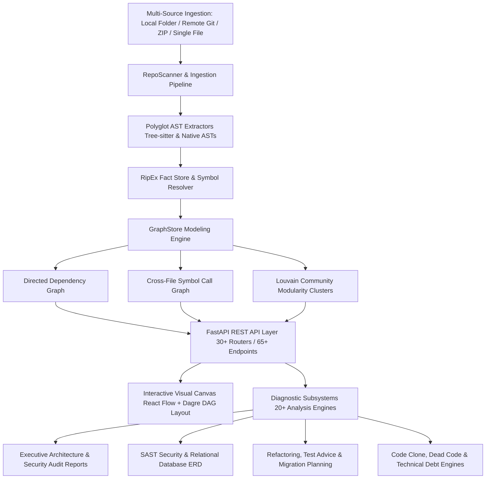

# NOUS
### Software Architecture Intelligence & Static Codebase Analysis Platform

Nous is an automated software architecture analysis and intelligence platform. It ingests polyglot source code repositories, constructs unified Abstract Syntax Tree (AST) representations, maps dependency and call graphs, and renders interactive, real-time architectural topology with integrated static analysis and diagnostics.

---

## Abstract

Modern software repositories frequently suffer from architectural erosion, hidden circular dependencies, untracked blast radiuses, and unvalidated structural drift. As codebases scale, mental models degrade, leading to unintended module coupling, security vulnerabilities, and unmaintainable technical debt.

Nous provides a unified, local-first system to parse, index, and analyze complex codebases across multiple programming languages without requiring external cloud dependencies or third-party API keys. By integrating formal grammar parsing engines (Tree-sitter and language-specific AST libraries) with graph-theoretic algorithms (NetworkX, Dagre layout engines), Nous produces deterministic models of file-level dependencies, symbol-level call graphs, and architectural community clusters. These models drive an interactive visual canvas and a comprehensive suite of 20 diagnostic subsystems, enabling engineering teams to inspect system boundaries, trace execution pathways, detect code clones, enforce architectural rules, and evaluate the blast radius of proposed modifications.

---

## System Architecture & Data Flow



---

## Core System Architecture & Foundations

### 1. Multi-Source Ingestion & Deterministic State Isolation
- **Local Directory Scanning**: Direct traversal of local file systems with full `.gitignore` parsing and exclusion filtering.
- **Real-Time Hot-Reloading Watch Mode**: Integrated background filesystem observers (`watchdog`) detect code changes, hot-recomputing ASTs and dynamically refreshing canvas topologies.
- **Remote Git Repository Cloning**: Automated shallow cloning (`--depth 50`) and branch selection for remote GitHub, GitLab, and Bitbucket repositories into sandboxed working directories.
- **Single Source Files & ZIP Archives**: Drag-and-drop parsing of individual source files and compressed archives into ephemeral inspection workspaces.
- **Deterministic Zero-State Architecture**: Boots in a clean, unpopulated state (`has_active_repo: false`), requiring explicit user selection to prevent cross-repository data contamination.

### 2. Polyglot Grammar Parsing & AST Extraction
- Leverages **Tree-sitter** grammars and language-specific AST engines to parse codebases across:
  - **Python**: `ast`, `libcst`
  - **TypeScript & JavaScript**: Tree-sitter TypeScript/TSX/JSX grammars
  - **Go**: Tree-sitter Go grammar
  - **Rust**: Tree-sitter Rust grammar
  - **Java & Kotlin**: Tree-sitter Java/Kotlin grammars
  - **Database Schemas**: SQL DDL (`CREATE TABLE`, foreign keys) and Prisma schema syntax
  - **Component Frameworks**: Vue (`.vue`), Svelte (`.svelte`), and C/C++ (`.c`, `.cpp`, `.h`)
- Extracts function definitions, class hierarchies, interface declarations, import/export bindings, call expressions, database relations, and HTTP route decorators.

### 3. Graph Modeling & Graph-Theoretic Algorithms
- **Directed Acyclic Graph (DAG) Layout**: Automated hierarchical topological sorting using Dagre layout engines.
- **Strongly Connected Components (SCC)**: Tarjan's algorithm for isolating circular dependency cycles across modules.
- **Community Modularity Clustering**: Louvain community detection to identify subsystem clusters and domain boundaries.
- **Centrality & Complexity Analysis**: In-degree (fan-in), out-degree (fan-out), betweenness centrality, and McCabe's Cyclomatic Complexity $v(G)$ computations per module and symbol.
- **Transitive Reachability Engine**: Graph traversal algorithms computing forward and backward blast radius cascades.

---

## Interactive Architecture Visualization Canvas

The Architecture Canvas renders dynamic, hardware-accelerated graph representations of the ingested codebase:

### Multi-Tier Visual Lenses
- **File Dependencies Lens**: Complete file-level dependency topology with directed acyclic layout.
- **Module Clusters Lens**: High-level structural communities grouped by architectural affinity and modularity.
- **Symbol Call Graph Lens**: Cross-file functional invocation graph mapping caller-callee bindings.
- **Frontend Architecture Lens**: Isolates user interface components, client routing, and state management hooks.
- **Backend Architecture Lens**: Isolates API routes, controllers, domain services, middleware, and data access layers.

### Minimap Viewport Radar & Navigation Controls
- **Interactive Viewport Frame**: Draggable and resizable bounding viewport slider providing real-time canvas navigation.
- **Continuous Magnification Slider**: Smooth zoom scaling from `20%` to `200%` with automatic canvas recentering.
- **Discrete Sector Controls**: Quick-jump presets targeting Ingress/Controllers (`Top`), Core Services (`Mid`), and Persistence/Storage (`Base`).

### Node Inspector Drawer
- Detailed metadata inspection displaying exact line counts, language type, and cyclomatic complexity.
- Dependency statistics: In-degree (dependents) and out-degree (dependencies).
- Import and export symbol catalogs.
- Integrated syntax-highlighted source code preview with direct line jumping.
- 1-click downstream transitive blast radius calculation.

---

## Diagnostic Subsystems & Analysis Engines

Nous incorporates 20 deterministic static analysis and diagnostic engines:

| Subsystem | Description | Primary Capabilities |
|---|---|---|
| **1. Executive Audit Report** | Executive architecture & security synthesizer | Composite health scorecard (Grade A–F), prioritized P0–P3 remediation matrix, Markdown export, and print-to-PDF formatting. |
| **2. Omni-Command Palette (`Ctrl+K`)** | Universal keyboard action and symbol launcher | Dual-mode action launcher (`>`) and AST symbol hybrid search (BM25 + Reciprocal Rank Fusion) with keyboard navigation. |
| **3. Diagram & Code Export Suite** | Architecture export engine | High-resolution PNG (`1x`, `2x`, `3x`), Vector SVG, Mermaid.js Markdown flowcharts, PlantUML class diagrams, and JSON topology export. |
| **4. Architecture Boundary Linter** | Layer constraint verification engine | Enforces strict architectural layering rules (e.g., `Persistence` cannot import `UI`) and flags boundary violations. |
| **5. Security SAST Scanner** | Static Application Security Testing | Detects hardcoded secrets, API tokens, unparameterized SQL injection vectors, and unsafe `eval`/`exec` execution routines. |
| **6. Database & Relational ERD** | SQL DDL & Prisma schema analyzer | Reconstructs relational tables, primary keys, foreign keys, and cardinalities into interactive Entity-Relationship Diagrams. |
| **7. Blast Radius & PR Impact** | Transitive impact and risk simulator | Quantifies downstream percentage impact and calculates commit diff blast radiuses for proposed pull requests. |
| **8. Code Clone Detector** | Structural duplication analysis | Uses AST subtree hashing to identify Type-1 (exact) and Type-2 (parameterized) duplicated code blocks. |
| **9. Dead Code Detector** | Unreachable symbol detection | Scans the call graph for zero-in-degree unused functions, unreferenced classes, and orphaned source files. |
| **10. Intelligent Test Advisor** | Unit test coverage advisor | Identifies high-complexity, high-risk untested functions and synthesizes ready-to-run unit test stubs (`pytest`, `jest`, `vitest`). |
| **11. Refactoring Advisor** | Automated clean code guidance | Detects code smells (God classes, long methods, circular cycles) and generates step-by-step refactoring transformations. |
| **12. Technical Debt Engine** | 8-dimension weighted debt matrix | Quantifies architectural debt across complexity, churn, cycles, clones, file sizing, dead code, docs, and maintainability. |
| **13. API Request Flow Tracer** | End-to-end request lifecycle tracer | Maps HTTP routes through controllers, middlewares, domain services, data layers, and database queries. |
| **14. Architecture Drift Detector** | Structural entropy tracker | Compares current codebase against historical snapshots to detect architectural erosion and unauthorized cross-layer links. |
| **15. Repository Time Machine** | Historical commit scrubber | Replays Git commit history sequentially, visualizing the structural evolution of the dependency graph over time. |
| **16. Execution Playback** | Step-by-step call flow simulator | Simulates and animates runtime execution pathways across functions and files on the visual canvas. |
| **17. Module Health Matrix** | Tabular package comparison | Compares Lines of Code, cyclomatic complexity, incoming callers, outgoing dependencies, and health grades across modules. |
| **18. Documentation Generator** | Automated Markdown synthesizer | Generates architecture blueprints, module catalogs, API endpoint specs, and contributor onboarding guides. |
| **19. Migration Planner** | Modernization roadmap engine | Produces phased migration roadmaps (e.g., JavaScript to TypeScript, Sync to Async) with file checklists and codemods. |
| **20. Architecture Style Detector** | Design pattern classifier | Classifies dominant architectural patterns (Layered, Microservices, Hexagonal, MVC, Event-Driven) with confidence scores. |

> For complete in-depth feature guides, workflows, and API specifications, see **[DOCUMENTATION.md](DOCUMENTATION.md)** or open the in-app documentation viewer in the UI.

---

## Repository Structure

```
nous/
├── backend/
│   ├── app/
│   │   ├── analysis/       # 20+ specialized intelligence and diagnostic engines
│   │   │   ├── executive_report.py    # Executive audit report synthesizer
│   │   │   ├── health_scorecard.py    # Health scorecard calculation engine
│   │   │   ├── tech_debt_engine.py    # 8-dimension technical debt analyzer
│   │   │   ├── security_scanner.py    # Static application security (SAST)
│   │   │   ├── database_analyzer.py   # SQL DDL & Prisma ERD analyzer
│   │   │   ├── clone_detector.py      # AST subtree code clone detector
│   │   │   ├── dead_code.py           # Unreferenced symbol & dead code detector
│   │   │   ├── test_advisor.py        # Test coverage & stub synthesizer
│   │   │   ├── refactoring_advisor.py # Code smell & refactoring engine
│   │   │   ├── api_flow_tracer.py     # End-to-end API lifecycle tracer
│   │   │   ├── drift_detector.py      # Architecture drift & entropy tracker
│   │   │   ├── timeline_engine.py     # Git commit replay & churn analytics
│   │   │   ├── doc_generator.py       # Markdown documentation synthesizer
│   │   │   ├── migration_planner.py   # Modernization & migration roadmaps
│   │   │   └── style_detector.py      # Architectural pattern classifier
│   │   ├── graph/          # GraphStore, DependencyGraph, and CallGraph models
│   │   ├── parsers/        # Tree-sitter grammar wrappers and AST extractors
│   │   ├── routers/        # 30 modular FastAPI REST routers (67 API endpoints)
│   │   ├── config.py       # Application settings and environment configuration
│   │   ├── git_cloner.py   # Remote repository cloning and history extraction
│   │   ├── scanner.py      # Repository scanner and AST orchestration engine
│   │   ├── state.py        # Centralized in-memory application state store
│   │   └── main.py         # FastAPI application entry point and static SPA serving
│   ├── tests/              # 44 automated integration and unit tests
│   └── pyproject.toml      # Python dependencies and build metadata
├── frontend/
│   ├── src/
│   │   ├── components/
│   │   │   ├── canvas/     # React Flow canvas, Dagre DAG layout, MinimapRadarControl
│   │   │   ├── dashboard/  # RepositoryDashboard telemetry and NoRepoWelcome onboarding
│   │   │   ├── layout/     # Header, FilterBar, and navigation toolbars
│   │   │   ├── search/     # Universal Omni-Command Palette (Ctrl+K)
│   │   │   ├── export/     # Diagram & Code Export Suite (PNG, SVG, Mermaid, PlantUML)
│   │   │   ├── report/     # Executive Architecture & Security Audit Report Modal
│   │   │   ├── docs/       # In-App Platform Documentation & User Manual Modal
│   │   │   └── [modals]/   # Specialized modals for each diagnostic subsystem
│   │   ├── services/       # Typed HTTP client API services
│   │   ├── types/          # Domain, AST, and graph TypeScript interfaces
│   │   ├── App.tsx         # Main application controller, modal state, and hotkeys
│   │   └── main.tsx        # React application entry point
│   ├── index.html          # Application HTML shell
│   ├── package.json        # Frontend dependencies and build scripts
│   └── vite.config.ts      # Vite build configuration
├── Dockerfile              # Production multi-stage Docker build
├── docker-compose.yml      # Container orchestration configuration
├── DOCUMENTATION.md        # Comprehensive platform user manual and API reference
└── README.md               # Project abstract, architecture, and quickstart guide
```

---

## Installation and Execution

### Prerequisites
- **Python**: Version `3.11` or higher
- **Node.js**: Version `18.0` or higher (with `npm`)
- **Git**: Installed and available in system `$PATH`

---

### Local Development Setup

#### 1. Backend Service
```bash
# Navigate to the backend directory
cd backend

# Initialize and activate Python virtual environment
python -m venv .venv

# On Linux / macOS:
source .venv/bin/activate
# On Windows (PowerShell):
.\.venv\Scripts\Activate.ps1

# Install dependencies in editable mode
pip install -e .

# Start the FastAPI development server on port 8000
python -m uvicorn app.main:app --host 127.0.0.1 --port 8000 --reload
```
The REST API will be available at `http://127.0.0.1:8000`.  
OpenAPI interactive documentation is accessible at `http://127.0.0.1:8000/docs`.

#### 2. Frontend Client
In a separate terminal window:
```bash
# Navigate to the frontend directory
cd frontend

# Install client dependencies
npm install

# Start the Vite development server
npm run dev -- --host 127.0.0.1 --port 5173
```
Open `http://localhost:5173` in your browser.

---

### Production Single-Binary Serving

The FastAPI backend is configured to serve the production-built React SPA bundle directly:

```bash
# 1. Build the production frontend assets
cd frontend
npm run build

# 2. Start the production backend server
cd ../backend
python -m uvicorn app.main:app --host 0.0.0.0 --port 8000
```
Navigate to `http://127.0.0.1:8000` to access the full application from a single unified port.

---

### Containerized Deployment (Docker)

Nous provides a multi-stage `Dockerfile` and `docker-compose.yml`:

```bash
# Build and launch the containerized application
docker compose up -d --build
```
Access the application at `http://localhost:8000`.

To stop the container:
```bash
docker compose down
```

---

## Quality Assurance & Verification

### Backend Automated Test Suite
```bash
cd backend
pytest tests/ -v
```
The backend test suite executes 44 automated integration and unit test modules validating AST parsing, graph algorithms, fact stores, and all analysis engines with `100%` pass rates.

### Frontend Type Safety & Production Build
```bash
cd frontend
npm run build
```
The frontend build performs strict TypeScript type validation (`tsc -b`) and asset bundling via Vite with zero compilation errors.

---

## Acknowledgements & Open-Source Ecosystem

Nous is constructed upon foundational open-source technologies:
- **Tree-sitter**: Incremental concrete syntax tree parsing and grammar ecosystem.
- **NetworkX**: Comprehensive graph-theoretic data structures and network algorithms.
- **React Flow (@xyflow/react) & Dagre**: Interactive node-based graph rendering and hierarchical DAG layout.
- **FastAPI**: Modern, high-performance asynchronous web framework for REST API implementation.
- **Tailwind CSS & Lucide Icons**: Modern styling and standardized technical iconography.

---

## License

This software is distributed under the terms of the **MIT License**. See the [LICENSE](LICENSE) file for complete details.
