# NOUS
### Enterprise Software Architecture Intelligence & Static Codebase Analysis Platform

[](https://python.org)
[](https://fastapi.tiangolo.com)
[](https://www.typescriptlang.org/)
[](https://react.dev)
[](https://vitejs.dev)
[](https://tree-sitter.github.io)
[-brightgreen?style=flat-square)](backend/tests)
[](LICENSE)
[](#core-design-principles)

**Nous** is an automated software architecture intelligence and static codebase analysis platform. It ingests polyglot source code repositories, constructs unified Abstract Syntax Tree (AST) representations, maps relational dependency and call graphs, and renders an interactive, hardware-accelerated architectural topology with integrated diagnostics, AI-powered architectural reasoning, and failure cascade simulation.

---

## Executive Summary & System Philosophy

As software systems scale, architectural drift, unvalidated circular dependencies, untracked blast radiuses, and hidden security vulnerabilities accumulate. Mental models degrade, making refactoring risky and cross-module impacts unpredictable.

Nous solves this with a **100% local-first, deterministic intelligence engine**. By combining formal grammar parsing engines (Tree-sitter and language-native AST parsers) with graph-theoretic algorithms (NetworkX, Dagre, Tarjan's SCC, Louvain Community Modularity), Nous produces mathematical models of file-level dependencies, symbol-level call invocations, and architectural boundaries without sending your proprietary code to third-party cloud servers.

For teams requiring deep architectural reasoning, Nous introduces **Architect AI**—a Graph-RAG assistant that grounds generative queries in your repository's exact AST facts and renders live sequence diagrams—alongside the **Interactive Ripple Effect Simulator**, which models the downstream blast radius and contract risks of proposed breaking or behavioral modifications.

---

## High-Level System Architecture

```mermaid
graph TD
    subgraph Ingestion ["1. Multi-Source Ingestion"]
        A1[Local Directory]
        A2[Remote Git Repo]
        A3[ZIP Archive]
        A4[Single Source File]
    end

    subgraph Parsing ["2. Polyglot AST Extraction"]
        B1[Tree-sitter Parser Engine]
        B2[Python ast / libcst]
        B3[SQL DDL & Prisma Grammar]
    end

    subgraph Modeling ["3. GraphStore & Fact Relational Engine"]
        C1[Directed Acyclic Dependency Graph]
        C2[Cross-File Symbol Call Graph]
        C3[Louvain Community Modularity]
        C4[RipEx Relational Fact Store]
    end

    subgraph Diagnostics ["4. Analysis & Intelligence Subsystems"]
        D1[Architect AI & Graph-RAG Engine]
        D2[Interactive Ripple Effect Simulator]
        D3[SAST Security & Data Flow Taint Engine]
        D4[Relational Database ERD Reconstructor]
        D5[Architecture Drift & Style Detector]
        D6[Code Clones, Dead Code & Tech Debt]
    end

    subgraph Presentation ["5. Interactive User Interface"]
        E1[React Flow Hardware-Accelerated Canvas]
        E2[Omni-Command Palette Ctrl+K]
        E3[Executive Audit Report & PDF Export]
        E4[Mermaid & PlantUML Diagram Exporter]
    end

    Ingestion --> Parsing
    Parsing --> Modeling
    Modeling --> Diagnostics
    Diagnostics --> Presentation
```



---

## Comprehensive Feature Breakdown

### 1. AI-Powered Architecture Intelligence & Graph-RAG

Nous bridges formal static analysis and generative AI through a privacy-centric, multi-provider architecture assistant:

* **Architect AI Assistant (`/api/architect-ai/query`)**:
  * **Graph-RAG Grounding**: Generates queries against an AST knowledge sub-graph instead of relying on loose text embeddings. Queries are enriched with actual file dependencies, caller/callee bindings, imported symbols, and cyclic dependencies.
  * **Interactive Architectural Q&A**: Answers deep structural questions (e.g., *"How does authentication flow from router to database?"*, *"Where are circular dependencies concentrated?"*).
  * **Dynamic Question Prompts**: Automatically analyzes the active repository to generate 5 contextual, codebase-specific questions tailored to your modules.
  * **Live Mermaid Sequence Diagrams**: Automatically synthesizes and renders interactive, step-by-step sequence diagrams showing runtime interactions between controllers, services, and repositories.
  * **Multi-Provider LLM Integration**: Built-in support for **Google Gemini** (`gemini-2.5-flash`), **Anthropic Claude** (`claude-3-5-sonnet`), **OpenAI** (`gpt-4o`), **Groq** (`llama-3.3-70b`), and local offline **Ollama** (`deepseek-r1`, `llama3`).
  * **Deterministic Offline Fallback**: Operates with a rule-based heuristic explainer even when no external API key is provided, ensuring zero external dependencies.

* **Semantic Natural Language Search (`NLSearch`)**:
  * Allows developers to query codebase architecture using natural language intent (e.g., *"Find database connection pooling logic"* or *"Show input validation middleware"*).
  * Synthesizes AST symbol metadata, function signatures, and docstrings to match relevant code paths.

---

### 2. Failure Cascade & Blast Radius Simulation

Predict the exact downstream impact of source code changes before writing a single line of code:

* **Interactive Ripple Effect Simulator (`/api/ripple/simulate`)**:
  * **Change Type Selectors**:
    * **Breaking Change**: Models modified function signatures, deleted exports, or altered type contracts with high downstream propagation weight.
    * **Behavioral / Logic Change**: Models internal implementation updates where contracts are preserved but runtime behavior changes.
    * **Additive / Backward-Compatible**: Models non-breaking additions with localized impact radius.
  * **Topological Distance Attenuation**: Computes cascading shockwaves using depth-bounded Breadth-First Search (BFS) weighted with exponential distance decay:
    $$\text{Impact Score}(v) = \text{Weight}(\text{type}) \times 0.85^{\text{dist}(u, v)}$$
  * **Contract Risk Matrix**: Flags critical upstream/downstream interface contracts threatened by the modification.
  * **Targeted Test Recommendations**: Automatically generates a prioritized list of test files and test suites required to validate the change.
  * **Blast Severity Gauge**: Displays a composite risk percentage (`0%` to `100%`) with clear Low, Medium, High, or Critical threat classifications.

* **Transitive Impact Simulator (`/api/impact`)**:
  * Calculates forward and backward reachability across the directed call graph.
  * Identifies all direct vs. transitive dependents for any selected file or symbol.
  * Provides "What-If" mutation simulation to evaluate architectural impact before refactoring.

* **Pull Request (PR) Impact Analyzer (`/api/pr-analyzer`)**:
  * Ingests Git diffs or pull requests, extracts modified symbols, and calculates PR blast radiuses.
  * Flags high-risk merges, breaking interface changes, and untested critical execution paths.

---

### 3. Interactive Architecture Canvas & Visual Lenses

An interactive, hardware-accelerated graph canvas powered by **React Flow** and **Dagre DAG layout**:

* **Multi-Tier Visual Lenses**:
  * **All Files View**: Complete file-level dependency topology across the entire codebase.
  * **Frontend Lens**: Isolates UI components, client-side routing, state stores, and hooks.
  * **Backend Lens**: Isolates HTTP routers, controllers, domain services, middleware, and database layers.
  * **Module Clusters Lens**: High-level structural communities grouped by Louvain modularity clustering.
  * **Symbol Call Graph Lens**: Fine-grained, cross-file function, method, and class invocation graph.

* **Minimap Radar & Viewport Controls**:
  * Interactive draggable/resizable viewport frame for instant navigation across large codebases.
  * Continuous zoom scaling (`20%` to `200%`) with automatic centering and bounding-box focus.
  * Discrete sector presets targeting **Ingress/Controllers** (*Top*), **Core Services** (*Mid*), and **Persistence/Data Access** (*Base*).

* **Node Inspector Drawer**:
  * Displays file size, lines of code (LOC), language grammar, and cyclomatic complexity $v(G)$.
  * In-degree (dependents/fan-in) and out-degree (dependencies/fan-out) metrics.
  * Complete symbol catalog of classes, functions, interfaces, imports, and exports.
  * Integrated syntax-highlighted source code preview with direct line jumping.
  * One-click downstream transitive blast radius calculation.

---

### 4. Static Application Security Testing (SAST) & Data Flow

* **Security SAST Vulnerability Scanner (`/api/security/scan`)**:
  * Scans codebases for hardcoded secrets, private keys, API credentials, and JWT tokens using Shannon entropy and regex heuristics.
  * Identifies unparameterized SQL queries susceptible to SQL injection (SQLi).
  * Flags dangerous dynamic execution routines (`eval`, `exec`, `Function`, `os.system`, `subprocess(shell=True)`).
  * Categorizes vulnerabilities with CWE (Common Weakness Enumeration) tags and actionable remediation advice.

* **Source-to-Sink Taint & Data Flow Analyzer (`/api/data-flow`)**:
  * Traces data flow from unvalidated input sources (HTTP query params, request bodies, route params) through transformation layers into sensitive sinks (database queries, shell executions, filesystem writes).
  * Highlights missing sanitization, authorization bypasses, and data leak paths.

* **Relational Database Schema & ERD Analyzer (`/api/database/schema`)**:
  * Parsers for raw SQL DDL (`CREATE TABLE`, primary keys, foreign key constraints) and Prisma schemas.
  * Reconstructs entity relationships, column data types, nullability, unique constraints, and cardinalities ($1:1$, $1:N$, $N:M$).
  * Renders an interactive visual Entity-Relationship Diagram (ERD) directly within the UI.

---

### 5. Code Quality, Technical Debt & Refactoring Engines

* **Executive Architecture & Security Audit Report (`/api/executive-report`)**:
  * Synthesizes all static analysis, security findings, and structural metrics into a single executive briefing.
  * Computes a holistic Software Health Scorecard with letter grading (**Grade A through F**).
  * Provides a prioritized **P0–P3 remediation roadmap** with estimated engineering effort.
  * Supports direct **Markdown export** and browser **Print-to-PDF** formatting.

* **8-Dimension Technical Debt Engine (`/api/tech-debt`)**:
  * Calculates technical debt using a weighted multi-variable matrix:
    1. Cyclomatic Complexity ($v(G)$)
    2. Code Churn Frequency
    3. Circular Dependency Cycles
    4. Code Clones & Duplication
    5. Oversized File Footprints
    6. Dead & Unused Code
    7. Documentation Deficits
    8. Maintainability Index
  * Visualizes technical debt distribution across repository packages and submodules.

* **AST Subtree Code Clone Detector (`/api/analysis/clones`)**:
  * Utilizes normalized AST subtree hashing to identify structural duplication across files.
  * Detects **Type-1** (exact duplicates with identical tokens) and **Type-2** (syntactically identical with renamed identifiers/literals) clones.
  * Highlights refactoring opportunities for shared utility extraction.

* **Dead Code & Orphaned Symbol Detector (`/api/dead-code`)**:
  * Traverses the symbol call graph to identify zero-in-degree functions, unreferenced classes, and orphaned source files.
  * Highlights unused imports and dead exports, reducing bundle footprint and maintenance overhead.

* **Intelligent Refactoring Advisor (`/api/refactoring/advice`)**:
  * Identifies code smells: God Classes, Feature Envy, Long Parameter Lists, Shotgun Surgery, and Circular Cycles.
  * Generates actionable, step-by-step refactoring strategies with structural before/after code designs.

* **Intelligent Test Advisor & Stub Generator (`/api/test-advisor`)**:
  * Isolates high-complexity, high-risk functions lacking unit test coverage.
  * Automatically generates ready-to-run unit test stubs formatted for `pytest`, `jest`, or `vitest`.

* **Comparative Module Health Matrix (`/api/module-health`)**:
  * Renders a comparative tabular matrix across all packages and directories.
  * Measures lines of code, cyclomatic complexity, incoming fan-in, outgoing fan-out, and maintainability grades.

---

### 6. System Evolution, Drift & Reverse Engineering

* **Architecture Drift & Entropy Detector (`/api/drift`)**:
  * Compares current repository architecture against historical snapshots or defined baseline models.
  * Detects architectural erosion: unintended cross-layer connections, violated layer boundaries, and structural decay over time.

* **Repository Time Machine & Git Commit Scrubber (`/api/timemachine`, `/api/timeline`)**:
  * Replays Git commit history sequentially to visualize how dependencies, module sizes, and file clusters evolved across commits.
  * Correlates commit frequency and developer churn with architectural hot-spots.

* **Architecture Style & Pattern Classifier (`/api/architecture/style`)**:
  * Automatically classifies dominant architectural paradigms (e.g., **Layered / N-Tier**, **Hexagonal / Ports & Adapters**, **Clean Architecture**, **MVC**, **Event-Driven**, **Microservices**) with percentage confidence ratings.

* **End-to-End API Route-to-Database Flow Mapper (`/api/api-mapper`, `/api/api-flow`)**:
  * Maps every HTTP endpoint through its controller, middleware, service handler, repository, and database queries in an end-to-end trace diagram.

* **Step-by-Step Execution Playback Simulator (`/api/playback`)**:
  * Simulates runtime execution flows across functions and files with animated node pulses directly on the graph canvas.

* **Semantic Knowledge Graph (`/api/knowledge-graph`)**:
  * Reconstructs high-level domain entities, data models, concepts, and architectural relationships beyond raw syntax trees.

* **Architecture Boundary Rules Linter (`/api/architecture/rules`)**:
  * Enables teams to enforce strict architectural rules (e.g., *"Controllers cannot directly import Database Models"*, *"UI Components cannot import Repositories"*).
  * Automatically flags rule violations during scans or CI/CD pipelines.

* **Automated Documentation Generator (`/api/doc-gen`)**:
  * Generates clean Markdown documentation of the system's architecture, package catalogs, and API endpoints.

---

### 7. Universal Developer Experience & Command Tools

* **Omni-Command Palette (`Ctrl+K` / `Cmd+K`)**:
  * Dual-mode universal launcher:
    * Type `>` to access all platform modals, diagnostic tools, and visual lenses with keyboard navigation.
    * Type any keyword to perform AST symbol hybrid search (BM25 + Reciprocal Rank Fusion) across all functions, classes, and files.

* **Diagram & Code Export Suite**:
  * Export visual canvas architectures to high-resolution **PNG** (`1x`, `2x`, `3x`), **Vector SVG**, **Mermaid.js Flowcharts**, **PlantUML Class Diagrams**, and raw **JSON Topology**.

* **Platform User Manual**:
  * Complete in-app interactive documentation viewer accessible directly from the top navigation bar.

---

## Supported Languages & Grammars

Nous provides deep AST extraction across polyglot ecosystems via Tree-sitter and language-native parsers:

| Language | Engine | Extracted Symbols & Relationships |
|---|---|---|
| **Python** | `ast`, `libcst` | Classes, functions, async coroutines, decorators, module imports (`from x import y`), call expressions, route decorators (`@app.get`) |
| **TypeScript / TSX** | Tree-sitter TypeScript | Interfaces, types, classes, functions, JSX components, ES module imports/exports, React hooks, method calls |
| **JavaScript / JSX** | Tree-sitter JavaScript | ES modules, CommonJS `require`, classes, functions, prototype calls, component tags |
| **Go** | Tree-sitter Go | Package definitions, structs, interfaces, functions, methods, package imports, goroutines |
| **Rust** | Tree-sitter Rust | Structs, traits, impl blocks, functions, `use` declarations, macro invocations |
| **Java & Kotlin** | Tree-sitter Java/Kotlin | Classes, interfaces, methods, annotations, package imports, inheritance hierarchies |
| **Database Schemas** | Custom SQL / Prisma Parsers | `CREATE TABLE`, column types, primary keys, foreign key constraints, Prisma model relations |
| **C / C++** | Tree-sitter C/C++ | Header includes (`#include`), structs, classes, functions, namespaces |
| **Svelte & Vue** | HTML/Svelte/Vue Parsers | Single-file components (SFC), script blocks, component dependencies |

---

## Project Directory Layout

```
nous/
├── backend/
│   ├── app/
│   │   ├── ai/                 # Architect AI & Graph-RAG context synthesis
│   │   │   ├── graph_rag.py        # Graph-RAG context builder & prompt assembler
│   │   │   └── llm_client.py       # Multi-provider LLM client (Gemini, Claude, GPT, Groq, Ollama)
│   │   ├── analysis/           # 37 specialized intelligence and diagnostic engines
│   │   │   ├── architect_ai.py     # AI architecture reasoning & sequence generator
│   │   │   ├── ripple_simulator.py # Interactive cascading failure simulator
│   │   │   ├── executive_report.py # Executive audit report synthesizer
│   │   │   ├── health_scorecard.py # Composite health scorecard calculation
│   │   │   ├── security_scanner.py # Static application security testing (SAST)
│   │   │   ├── database_analyzer.py# SQL DDL & Prisma ERD reconstructor
│   │   │   ├── data_flow.py        # Source-to-sink taint tracking engine
│   │   │   ├── tech_debt_engine.py # 8-dimension technical debt analyzer
│   │   │   ├── clone_detector.py   # AST subtree structural code clone detector
│   │   │   ├── dead_code_detector.py # Zero-in-degree unreferenced symbol detector
│   │   │   ├── refactoring_advisor.py # Code smell detection & refactoring plans
│   │   │   ├── test_advisor.py     # Test gap advisor & test stub generator
│   │   │   ├── architecture_drift.py # Architecture drift & entropy tracker
│   │   │   ├── architecture_detector.py # Architectural pattern classifier
│   │   │   ├── api_mapper.py       # End-to-end API lifecycle mapper
│   │   │   ├── execution_playback.py # Step-by-step runtime playback simulator
│   │   │   ├── timeline_engine.py  # Git commit replay & churn analytics
│   │   │   ├── knowledge_graph.py  # Semantic knowledge graph generator
│   │   │   └── rules_engine.py     # Architectural boundary rule enforcer
│   │   ├── graph/              # GraphStore, DependencyGraph, CallGraph data structures
│   │   ├── parsers/            # Tree-sitter polyglot grammar wrappers and AST extractors
│   │   ├── routers/            # 36 modular FastAPI REST routers (70+ API endpoints)
│   │   ├── config.py           # App settings, environment configs, and API key management
│   │   ├── git_cloner.py       # Sandboxed remote Git cloning and branch resolution
│   │   ├── scanner.py          # Master repository scanner and AST orchestration engine
│   │   ├── state.py            # Centralized in-memory active repository state store
│   │   └── main.py             # FastAPI entry point, CORS middleware, and static SPA serving
│   ├── tests/                  # 52 automated integration and unit tests (100% passing)
│   └── pyproject.toml          # Python package specifications and dependencies
├── frontend/
│   ├── src/
│   │   ├── components/
│   │   │   ├── ai/             # Architect AI Modal (Graph-RAG & Mermaid sequence diagrams)
│   │   │   ├── ripple/         # Interactive Ripple Effect Simulator Modal
│   │   │   ├── canvas/         # React Flow canvas, Dagre layout, Minimap Radar
│   │   │   ├── dashboard/      # Repository Dashboard and zero-state welcome view
│   │   │   ├── layout/         # Header navigation bar and FilterBar controls
│   │   │   ├── search/         # Universal Omni-Command Palette (Ctrl+K)
│   │   │   ├── export/         # High-resolution diagram and code export suite
│   │   │   ├── report/         # Executive Audit Report Modal & PDF print view
│   │   │   ├── database/       # Relational Database ERD Schema Modal
│   │   │   ├── security/       # Security SAST Vulnerability Audit Modal
│   │   │   ├── docs/           # In-App Platform User Manual & Documentation Modal
│   │   │   └── [subsystems]/   # Modals for each diagnostic engine
│   │   ├── services/           # Typed HTTP client API services
│   │   ├── types/              # Complete TypeScript interfaces for AST, graph, and diagnostics
│   │   ├── App.tsx             # Root application state, keyboard shortcuts, modal management
│   │   └── main.tsx            # React entry point
│   ├── package.json            # Client dependencies and build scripts
│   └── vite.config.ts          # Vite build configuration
├── Dockerfile                  # Multi-stage production container build
├── docker-compose.yml          # Container orchestration configuration
├── DOCUMENTATION.md            # Comprehensive user manual and detailed API guide
└── README.md                   # Platform documentation and quickstart guide
```

---

## Installation & Quickstart

### System Prerequisites
* **Python**: `3.11` or higher
* **Node.js**: `18.0` or higher (with `npm`)
* **Git**: Installed and accessible in `$PATH`

---

### Local Development Setup

#### 1. Backend Service
```bash
# Navigate to backend
cd backend

# Create and activate virtual environment
python -m venv .venv

# Linux / macOS:
source .venv/bin/activate
# Windows (PowerShell):
.\.venv\Scripts\Activate.ps1

# Install dependencies in editable mode
pip install -e .

# (Optional) Set an API key for live external LLMs in Architect AI:
# export GEMINI_API_KEY="your-key"
# export OPENAI_API_KEY="your-key"
# export ANTHROPIC_API_KEY="your-key"
# export GROQ_API_KEY="your-key"
# Note: Nous functions 100% locally with built-in heuristic fallbacks if no key is set.

# Start FastAPI server on port 8000
python -m uvicorn app.main:app --host 127.0.0.1 --port 8000 --reload
```
* The REST API will be live at `http://127.0.0.1:8000`.
* Interactive OpenAPI documentation is accessible at `http://127.0.0.1:8000/docs`.

#### 2. Frontend Client
In a separate terminal:
```bash
# Navigate to frontend
cd frontend

# Install client dependencies
npm install

# Start Vite development server
npm run dev -- --host 127.0.0.1 --port 5173
```
Open **`http://localhost:5173`** in your browser to begin exploring.

---

### Production Single-Port Serving

The FastAPI backend can serve the compiled React SPA directly from a single port without a reverse proxy:

```bash
# 1. Compile frontend production bundle
cd frontend
npm run build

# 2. Start the unified production server
cd ../backend
python -m uvicorn app.main:app --host 0.0.0.0 --port 8000
```
Open `http://localhost:8000` to access the entire platform.

---

### Docker & Container Deployment

Deploy the entire stack with a single command via Docker Compose:

```bash
# Build and start containers in background
docker compose up -d --build
```
Access the application at `http://localhost:8000`.

To stop the services:
```bash
docker compose down
```

---

## Verification & Quality Assurance

Nous maintains strict verification standards across both backend and frontend layers:

### Backend Automated Test Suite
```bash
cd backend
pytest tests/ -v
```
* **52 automated unit and integration tests** validating AST parsing, graph algorithms, fact stores, security rules, and all 37 diagnostic engines with **100% pass rates**.

### Frontend Type Safety & Production Build
```bash
cd frontend
npm run build
```
* Strict TypeScript compilation (`tsc -b`) and asset bundling via Vite with **zero type errors or lint warnings**.

---

## Acknowledgements & Open-Source Foundations

Nous is built upon exceptional open-source software:
* **[Tree-sitter](https://tree-sitter.github.io)**: Incremental concrete syntax tree parsing and grammar ecosystem.
* **[NetworkX](https://networkx.org)**: Graph data structures, centrality metrics, and network algorithms.
* **[React Flow (@xyflow/react)](https://reactflow.dev) & [Dagre](https://github.com/dagrejs/dagre)**: Interactive canvas rendering and hierarchical DAG layout.
* **[FastAPI](https://fastapi.tiangolo.com)**: High-performance asynchronous REST API framework.
* **[Tailwind CSS](https://tailwindcss.com) & [Lucide Icons](https://lucide.dev)**: Design system and technical iconography.

---

## License

This software is distributed under the terms of the **MIT License**. See the [LICENSE](LICENSE) file for complete details.
